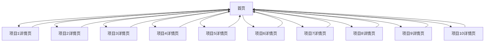

## 1. Product Overview
数据分析技术实战项目学习平台，为零基础学生提供系统化的数据分析技能训练。
- 帮助学生通过10个实战项目掌握数据分析的核心技能，从基础到进阶
- 目标用户为大二学生及其他对数据分析感兴趣的初学者

## 2. Core Features

### 2.1 User Roles
| Role | Registration Method | Core Permissions |
|------|---------------------|------------------|
| 普通用户 | 无需注册 | 浏览所有项目内容 |

### 2.2 Feature Module
1. **首页**：项目列表、导航栏
2. **项目详情页**：项目目标、数据来源、所需工具、学习要点

### 2.3 Page Details
| Page Name | Module Name | Feature description |
|-----------|-------------|---------------------|
| 首页 | 导航栏 | 显示10个项目的标题，点击可跳转到对应详情页 |
| 首页 | 项目列表 | 以卡片形式展示10个项目，包含项目名称和简要描述 |
| 项目详情页 | 项目信息 | 展示项目目标、数据来源、所需工具、学习要点 |
| 项目详情页 | 返回按钮 | 可返回首页 |

## 3. Core Process
用户访问首页，浏览10个项目的列表，点击感兴趣的项目进入详情页查看详细信息，看完后可返回首页继续浏览其他项目。

## 4. User Interface Design
### 4.1 Design Style
- 主色调：浅绿色 (#E6F4EA)
- 辅助色：深绿色 (#4CAF50)
- 按钮风格：圆角按钮
- 字体：无衬线字体，标题18-24px，正文14-16px
- 布局风格：卡片式布局，圆角卡片
- 图标风格：简约线条图标

### 4.2 Page Design Overview
| Page Name | Module Name | UI Elements |
|-----------|-------------|-------------|
| 首页 | 导航栏 | 顶部固定导航栏，白色背景，包含10个项目的链接，响应式设计 |
| 首页 | 项目列表 | 网格布局，每个项目为一个圆角卡片，浅绿色背景，悬停效果 |
| 项目详情页 | 项目信息 | 白色背景，卡片式内容区块，清晰的标题和内容层次 |
| 项目详情页 | 返回按钮 | 左上角返回按钮，圆角设计，悬停效果 |

### 4.3 Responsiveness
- 桌面优先设计，同时支持平板和移动设备
- 在小屏幕上，项目列表从网格布局变为单列布局
- 导航栏在小屏幕上变为下拉菜单

### 4.4 3D Scene Guidance
- 无3D场景需求