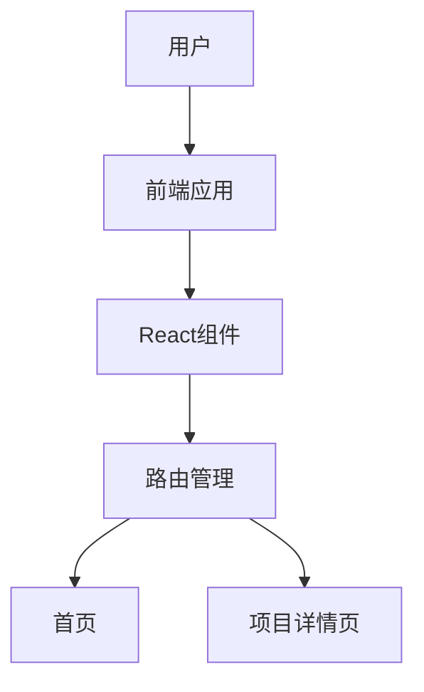

## 1. Architecture Design

## 2. Technology Description
- Frontend: React@18 + tailwindcss@3 + vite
- Initialization Tool: vite-init
- Backend: None
- Database: None

## 3. Route Definitions
| Route | Purpose |
|-------|---------|
| / | 首页，展示10个项目的列表 |
| /project/1 | 项目1：数据感知与基础处理 |
| /project/2 | 项目2：数据可视化基础 |
| /project/3 | 项目3：探索性数据分析(EDA) |
| /project/4 | 项目4：业务指标构建与分析 |
| /project/5 | 项目5：统计推断与假设检验 |
| /project/6 | 项目6：机器学习基础应用 |
| /project/7 | 项目7：时间序列分析 |
| /project/8 | 项目8：文本数据分析 |
| /project/9 | 项目9：数据仪表盘构建 |
| /project/10 | 项目10：综合实战项目 |

## 4. API Definitions
- 无API需求，所有数据均为静态数据

## 5. Server Architecture Diagram
- 无后端需求

## 6. Data Model
- 无数据库需求，使用静态数据

### 6.1 Data Model Definition
- 项目数据结构：
  - id: number
  - title: string
  - description: string
  - goal: string
  - dataSource: string
  - tools: string[]
  - learningPoints: string[]

### 6.2 Data Definition Language
- 无数据库需求